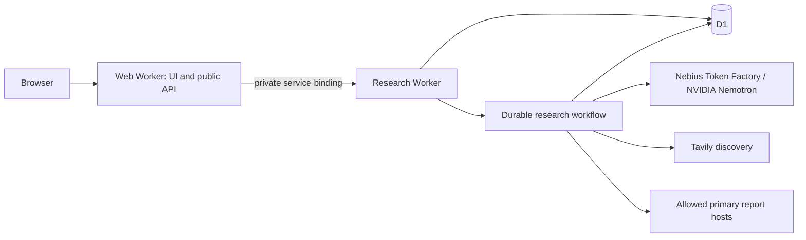

# Architecture

The production application lives in `src/web/`. It uses vinext with React and the Next.js App Router conventions on Cloudflare Workers.

## Responsibilities

- The web Worker renders saved examples, handles browser requests, and issues signed session/job cookies.
- The research Worker enforces access and shared usage limits. The reception service handles chat, limited-use research codes, and explicit contact submissions.
- The Workflow attempts three fiscal-year reports concurrently and retains partial evidence when individual sources or extraction chunks fail.
- Nebius provides model inference. Tavily discovers candidate report URLs. The trusted application retrieves and validates primary documents itself.
- D1 stores jobs, bounded source text, provenance, quotations, reception records, and access-code usage. Versioned SQL lives in `src/web/research/migrations/`.

The production email binding is restricted to the configured sender and recipient. Preview has no email binding and reports contact delivery as unavailable.

## Evidence and operational boundaries

Source URLs and redirects are restricted to exact configured hosts. Downloads and extraction are bounded. Model output is schema-checked, and accepted excerpts must match retrieved text. Dates, attribution, interpretation, and promise fulfillment still require review.

The live report is an evidence inventory. The Python collector, ledger, and original leadership UI are separate offline tooling; do not imply full feature parity. Saved public examples must remain labeled as saved research.

Live job evidence expires after seven days. Research continues after a browser closes. Installation quotas and provider quotas are separate. Tavily remains a discovery dependency; the cache/fallback proposal is not yet implemented.

Production and preview use separate Workers, Workflow names, D1 databases, and secrets. See [deployment](deployment.md). Keep large raw documents and expanded archives out of D1 until storage requirements justify another service.
