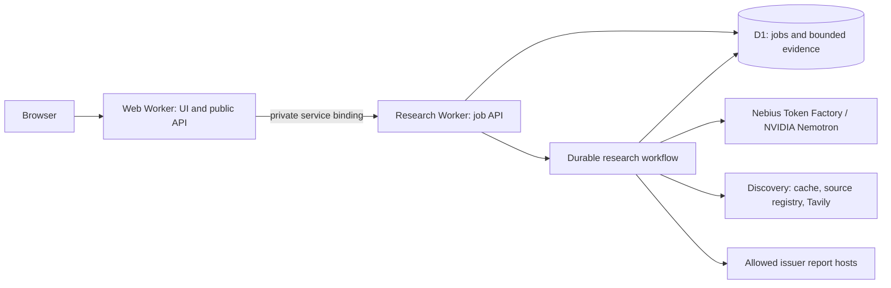

# Hackathon readiness proposal

Reviewed October 1, 2026. This is a proposed implementation sequence, not a record of completed infrastructure work. The exact event, submission deadline, team size, and destination GitHub repository are still to be confirmed.

## Recommended decisions

Keep the current Cloudflare architecture for the submission. Use GitHub Actions for checks and coordinated deployment. Start with `main` and short-lived feature branches, plus local development and an isolated hosted preview environment. Make annual-report discovery resilient through verified source reuse before adding a second search vendor.

Prioritize one complete product path: select a supported company, collect annual-report evidence, inspect exact quotations and coverage gaps, and download the evidence bundle. The live application currently produces an evidence inventory. It does not implement the full Python promise-to-outcome ledger or establish individual management credibility.

## Observed state

| Area | Evidence from this workspace | Consequence |
| --- | --- | --- |
| Runtime | `src/web` uses vinext, two Workers, Cloudflare Workflows, and D1 | The core platform is already in place |
| Inference | `research/providers.ts` calls Nebius Token Factory; configuration selects `nvidia/nemotron-3-super-120b-a12b` | Document the actual NVIDIA model and its role |
| Search | Discovery requires Tavily and forces a search call; all HTTP failures become generic provider errors | There is no live discovery fallback |
| Persistence | Artifacts belong to individual jobs and expire after seven days | Stored artifacts are not a reusable discovery cache |
| Deployment | Both Wrangler files contain one installation's configuration; deployment is manual | Add explicit preview isolation and repeatable setup |
| CI | Existing workflows check secrets, plugin validation, and plugin version changes | Application checks and Cloudflare deployment are missing |
| Git | `git status` reports this directory is not a Git repository | Branches, history, remote, and branch protections cannot be verified here |
| Documentation | Root README primarily describes the inherited Claude financial-services library | Judges need a product-first entry point and clear attribution |
| Current source | Type checking fails on missing `components/Reception` and an `unknown` response value in `ResearchResult.tsx` | Stabilize the current source before enabling releases |

The reception API proxy and a reception database schema also exist, but the inspected research Worker does not implement the proxied reception routes. Decide whether reception belongs in the submission and complete that path if it does. It should not become a dependency that prevents the core research demo from working.

## Architecture to freeze

The discovery cache and source registry are proposed additions. Keep the existing source-host restrictions, bounded downloads, schema validation, exact-quotation checks, and partial-coverage disclosures through every discovery path.

Continue with D1 for the bounded text workload. Consider R2 when retaining original documents or a larger archive becomes a requirement. Consider moving parsing or research execution to Nebius compute only if a measured runtime limit or an event requirement justifies the extra deployment work. Avoid a platform migration solely for branding.

If this is the [Nebius x NVIDIA Global AI Hackathon](https://nebiusglobalaihackathon.devpost.com/rules), a runtime Token Factory inference call satisfies its Nebius execution definition; an NVIDIA open source model is also required. My reading is that the present Cloudflare hosting arrangement fits that infrastructure requirement. Confirm the actual event before treating this as the submission checklist.

Done when the architecture document identifies the production path, provider responsibilities, data retention, runtime limits, and the distinction between saved examples and live research.

## Branches and environments

| Git source | Environment | Purpose |
| --- | --- | --- |
| `feat/*`, `fix/*`, `docs/*` | Local development; CI on pull requests | Small, reviewable changes |
| Explicitly selected trusted pull-request commit | Shared hosted preview | Test the complete application before merging |
| `main` after required checks | Production | Stable public application |
| `submission-v1` tag | Pinned judged release | Reproduce the submitted code and demo |

A `preview` environment does not require a permanent `preview` branch. Add a long-lived `dev` branch only if the team needs an integration line that cannot stay releasable. Otherwise, it adds another merge path and another opportunity for drift.

For the first iteration, use one shared preview environment with a single selected commit, serialized deployments, and a visible commit identifier. If simultaneous previews become necessary, provision a full stack per pull request and clean up its resources when the pull request closes.

Give preview separate web/research Worker names, a separate Workflow, a separate D1 database, separate application secrets, and smaller usage limits. The preview web service binding must target the preview research Worker. Wrangler bindings and variables need explicit environment configuration; see [Cloudflare environments](https://developers.cloudflare.com/workers/wrangler/environments/).

Pin the submission deployment during judging, or move ongoing development to a separate deployment so later commits do not change the judged experience.

## CI/CD

Use GitHub Actions to coordinate the database and both Workers. Cloudflare documents the [GitHub Actions deployment integration](https://developers.cloudflare.com/workers/ci-cd/external-cicd/github-actions/). Keep one system responsible for production deployments to avoid competing builds.

Proposed pull-request checks, using `src/web` as the application working directory:

1. Install the committed lockfile with a pinned, compatible Node/npm toolchain.
2. Generate both Workers' binding types and run type checking.
3. Run unit tests and the existing deterministic Workflows/D1 runtime tests.
4. Build the frontend and validate both Worker deployment bundles.
5. Run secret scanning. Run Python tests when the retained collector or shared issuer configuration changes.

Provider-mocked tests should be the required gate. Put real provider smoke tests behind an explicit trusted deployment action with a small budget, since external availability and credits should not determine whether every pull request can pass.

Proposed deployment order:

1. Check the exact commit that will be deployed and resolve all configuration for the target environment.
2. Apply versioned, backward-compatible D1 migrations to that environment.
3. Deploy the research Worker and Workflow.
4. Deploy the matching web Worker from its generated frontend configuration.
5. Check the homepage, access rejection, job submission, recovery, and evidence download in preview before promotion.

Convert the current schema bootstrap into tracked [D1 migrations](https://developers.cloudflare.com/d1/reference/migrations/). Retain compatibility with the previous Worker version so code rollback remains possible; rolling back code does not undo database changes.

Production deployments should be serialized and finish before a newer deployment starts. Pin third-party Actions, use minimal GitHub permissions and scoped Cloudflare credentials, and expose deployment secrets only to trusted deployment jobs. External pull requests can run credential-free checks. Do not run untrusted pull-request code with production secrets.

Resolve the intended repository and upstream history before initializing or importing this directory. Creating commits and pushing changes is the developer workflow; CI validates those changes and CD deploys them. There is no need for automation that invents or pushes ordinary code commits.

Done when a clean checkout passes the checks, preview uses isolated resources, a checked main commit deploys both Workers successfully, and the last known working release can be restored.

## Tavily resilience and spending

Current discovery allows at most two logical searches per year across three years. Every request uses `advanced`, which costs two credits according to [Tavily pricing](https://docs.tavily.com/documentation/api-credits). This gives a ceiling of 12 credits per fully searched job before retries, or 120 per day at the current ten-job limit. Other consumers of the same account and replayed requests can add to usage; job limits are not a provider spending cap.

Implement discovery in this order:

1. Reuse a validated issuer/year result from a shared cache, checking its freshness and source identity.
2. Use a small verified registry of official annual-report URLs for the seven supported companies and covered fiscal years. Record the fiscal period, URL, retrieval time, hash, and provenance; revalidate downloads and retain existing host checks.
3. Use Tavily for missing or stale discovery. Evaluate `basic` search on representative reports and escalate to `advanced` only when needed.
4. Optionally add another search provider behind the same discovery contract if broad company coverage warrants it. Validate that provider independently before calling it a fallback.
5. When live research cannot proceed, explain the unavailable capability and offer explicitly labeled saved examples. Never present a saved result as a new live run.

Handle transient rate limits separately from exhausted credit limits. Tavily documents 429 for excessive requests and 432/433 for usage or pay-as-you-go limits in its [search API](https://docs.tavily.com/documentation/api-reference/endpoint/search). Use bounded backoff for transient failures. On quota exhaustion, temporarily disable further paid discovery across jobs and use the fallback path. Do not retry exhausted credit limits as ordinary transient errors.

Persist provider usage, retry counts, and fallback reason by job. Reserve a bounded search budget before dispatching concurrent work, and reconcile it with returned usage and the provider account. The current response parser does not retain Tavily credit usage. Keep a demonstration reserve and a clear operator control for disabling new paid jobs.

Done when a fresh supported-company run can use known primary reports with Tavily disabled, a missing report produces an honest coverage gap, and tests distinguish quota exhaustion, rate limiting, malformed responses, and unavailable sources.

## Documentation and submission

Make the root README describe Wallstreet first: target user, problem, live demo, screenshots, quick start, architecture, NVIDIA/Nebius usage, and a short explanation of evidence limitations. Keep the provenance and license notices for inherited material and clearly identify the team's own contribution. Inventory unused template content before deciding whether to omit it from the submission repository.

Suggested small document set:

- `README.md`: product and judge entry point.
- `docs/architecture.md`: components, data flow, contracts, limitations, and design decisions.
- `docs/deployment.md`: local setup, preview/production configuration, migrations, secrets, smoke checks, and rollback.
- `docs/research-reliability.md`: source policy, provider budgets, fallback behavior, and retention.
- `docs/submission.md`: reproducible demo steps, release commit, required materials, and what was built during the event.

For the Global event, the rules call for a public licensed repository with setup instructions, a working demo, NVIDIA/Nebius usage details, and a public YouTube demo under three minutes. Existing projects must explain their significant event-period changes. The demo must remain accessible through judging. Verify the event-specific dates and access instructions before submission. [Official rules](https://nebiusglobalaihackathon.devpost.com/rules).

The current shared access code, ten-job daily limit, two-job concurrency limit, and seven-day retention need a deliberate judging plan. Keep saved examples available independently of expiring job evidence, test judge access, and reserve enough live capacity for evaluation.

Show one concrete differentiator in the demo: a model-extracted management statement linked to its exact annual-report quotation, with the coverage and interpretation limits visible. Measure completed reports, accepted/rejected quotations, run duration, and provider usage. Exact quotation matching alone does not prove semantic correctness or management credibility.

## Implementation order

1. Stabilize the current application and resolve the intended Git repository.
2. Freeze the architecture and submission product scope.
3. Add application CI and isolated preview/production configuration.
4. Add versioned migrations and coordinated deployment with rollback instructions.
5. Add verified source reuse, quota-aware behavior, and a dependable saved-demo path.
6. Rewrite the root documentation, rehearse a fresh setup, record the demonstration, and pin the submission release.

## Validation performed in this review

- Read the application source, provider/workflow code, deployment configuration, existing workflows, and documentation.
- Type checking failed on the two source issues recorded above.
- All 21 current unit tests passed using `node --import tsx --test tests/*.test.*`. The npm test wrapper could not create its local IPC socket in the sandbox, so the same test files were run directly through Node and the tsx loader.
- Production build, Workflows/D1 integration tests, live provider calls, GitHub configuration, and deployed environment state were not verified in this review.
- No application code, remote configuration, repository branches, or deployments were changed by this proposal.
