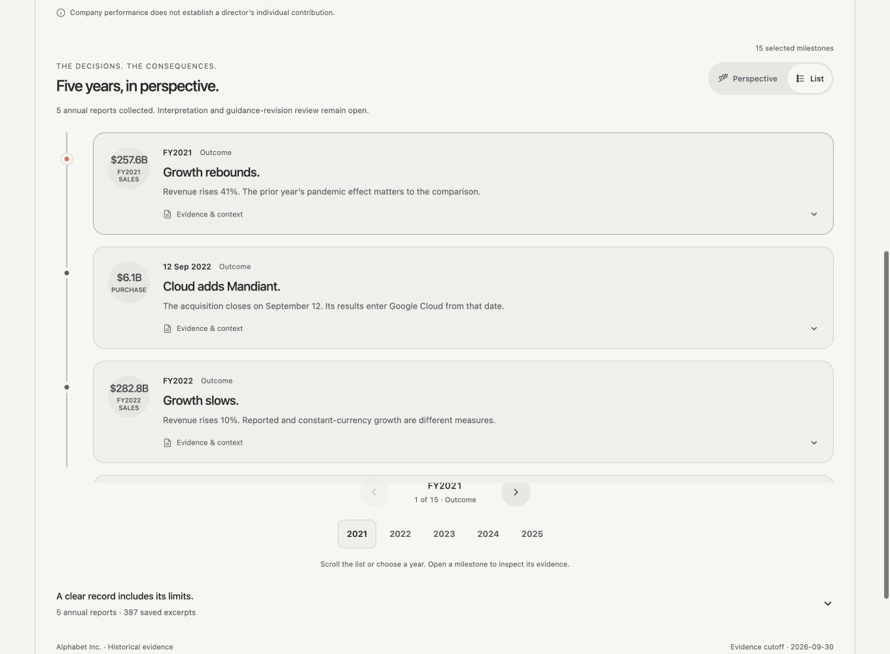
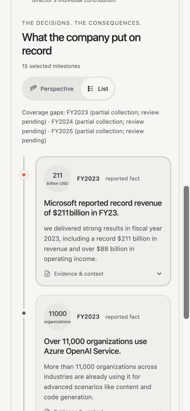

# Timeline views

Verified on October 1, 2026.

## Interaction

- Perspective and List share one selected milestone and one persistent rail.
- Content fades to zero before the rail moves. Four independent physical spring tracks move and rotate the line. Content returns only when all tracks settle.
- Rapid reversal starts from current values and retains incoming velocity. The view switch remains enabled throughout.
- Reduced motion skips the fading and morphing sequence and changes views directly.
- List cards disclose the existing evidence inline. Year shortcuts scroll the chosen milestone into view. Returning to Perspective retains the selection.
- Arrow keys, Home, and End work on the tablist with roving focus. Inactive content is inert and hidden from accessibility tools. View buttons have 44px touch targets.

## Visual checks

Both Alphabet and Microsoft examples were checked in the browser. The list uses existing report colors, circular figures, typography, and disclosure styling. At 1360px, cards have a horizontal figure and text layout. At 390px and 320px, the date sits beside the figure and the title and summary use the full card width. The page has no horizontal overflow at either phone width.

## Validation

- TypeScript check passes.
- 28 tests pass, including the real Motion spring velocity handoff, rail geometry, transition ordering, interrupted completion handling, and reduced motion.
- Production build passes. The existing vinext dynamic-import warning remains.
- Browser checks cover list evidence expansion, year navigation, keyboard switching, selection preservation, and interruption while the content is hidden.
- Deployed frontend version: `c9a4ba18-4495-411a-a0c7-bbb898917c95`. The live Alphabet page reaches List with all 15 milestones, a vertical 512px rail, and fully restored content. No browser warnings or errors were recorded in the fresh production tab. The backend was unchanged.

## Motion controls

`components/report/timeline-views.css` contains the fade-out, spring response, fade-in, and rail inset tokens. Default fades are 150ms out and 250ms in. The 500ms response token determines critically damped physical spring parameters; actual settling time depends on distance and incoming velocity. The sliding tabs snippet is retained from transitions-dev with separate report theme overrides.
